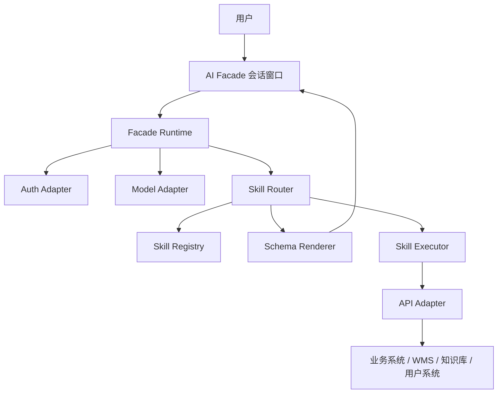

# 公司级 AI Facade PRD

## 1. 背景

企业内部通常存在多个中后台系统，例如 WMS、商品、库存、知识库、权限、审批等系统。随着业务系统数量增加，用户面临以下问题：

- 不知道功能入口在哪个系统、哪个菜单。
- 简单查询需要跨系统跳转。
- 创建、修改类操作依赖复杂表单和业务规则。
- 新人培训成本高，业务系统能力难以被统一复用。
- 现有系统已经具备接口和页面能力，但缺少自然语言入口和统一编排层。

AI Facade 希望作为公司级中后台之上的统一自然语言入口，把用户意图转化为受控的业务能力调用、生成式 UI、深链跳转或结果展示。

## 2. 产品定位

AI Facade 是一个公司级中台 Facade，定位为：

> 面向企业中后台系统的 AI 会话入口、生成式 UI Runtime 与 Skill 执行平台。

它不是单纯的 Chatbot，也不是替代原有中后台系统，而是站在原系统之上，提供：

- 统一会话入口。
- SSO 与用户身份上下文。
- 大模型接入与意图识别。
- Skill 匹配、参数提取与执行编排。
- 基于 Schema 的生成式 UI 渲染。
- 与现有业务系统的 Adapter 对接能力。
- 可被项目集成或独立部署的运行时。

### 2.1 当前阶段判断

截至 MVP Demo 初步闭环阶段，项目已经验证了以下假设：

- Workbench 形态可以承载公司级 AI 中后台入口，而不是简单聊天气泡。
- 宿主项目 `src/skills/agent.json -> skill/mcp.json -> apis/components` 的 Skill 装载路径可行。
- Runtime 可以完成 `自然语言输入 -> Skill 召回 -> Mock Model Judge -> 原子能力执行 -> 生成式 UI 下行` 的最小闭环。
- Vue Demo 可以验证普通问答、生成式表单、二次确认、复杂业务跳转、查询结果展示和自定义组件。

因此，下一阶段的重心应从 Workbench 视觉体验转向：

- 协议 v0.1 收束。
- Schema UI MVP 能力补齐。
- Skill 开发者体验和文档。
- 宿主项目低侵入接入验证。

Workbench 仍然是 Facade 的重要承载层，但在进入 P2 前不应继续无限扩展视觉细节。后续 UI 工作只围绕协议落地、Schema UI 可用性和开发调试效率展开。

### 2.2 非目标提醒

当前阶段不把 AI Facade 发展成以下产品：

- 纯聊天机器人。
- 替代原有中后台系统的完整业务页面。
- 通用低代码表单搭建器。
- 多项目统一 Skill 平台。
- 公司级生产治理平台。

这些能力可以在后续里程碑中扩展，但 MVP 与 P2 的核心是证明：业务开发者可以按标准编写 Skill，宿主项目可以低成本接入 Facade，并稳定运行生成式 UI 与原子能力。

## 3. 产品形式

### 3.1 NPM 包

AI Facade 以 NPM 包形式提供一个无强依赖的会话窗口与运行时能力。

核心目标：

- 尽量少侵入宿主项目。
- 可嵌入现有中后台项目。
- 可单独部署成独立入口。
- 内部包含默认会话、运行时、渲染器和 Skill 调度能力。
- 通过 Adapter 适配服务端能力、业务能力、模型来源、权限系统、埋点系统等。

### 3.2 部署形式

第一版优先支持嵌入式部署，独立部署作为后续形态保留。

1. 嵌入式部署
   - 业务项目安装 NPM 包。
   - 在现有项目中挂载 AI Facade 主工作区。
   - 复用宿主项目的登录态、接口网关和权限体系。
   - 通过 Adapter 对接模型、业务接口、权限、路由和埋点。

2. 独立部署（后续规划）
   - AI Facade 作为独立 Web 应用运行。
   - 通过统一 SSO 登录。
   - 通过 Adapter 或服务端聚合层访问多个业务系统。
   - 适合跨多个业务项目统一运行 Skill 的阶段。

## 4. 核心用户与使用场景

### 4.1 目标用户

- 企业内部运营人员。
- 仓储、商品、库存、客服等业务人员。
- 中后台系统使用者。
- 业务系统开发者。
- 平台管理员。

### 4.2 典型场景

#### 4.2.1 普通问答型

用户输入：

> storage level 是什么意思？

AI Facade 行为：

- 未命中明确业务 Skill 时，进入普通问答能力。
- 通过默认模型能力进行回答。
- 如果问题与业务概念相关，可结合已注册 Skill、业务词典或知识库进行增强回答。
- 普通问答不直接执行业务写操作。

#### 4.2.1 查询型

用户输入：

> 查看某某用户的当前信息

AI Facade 行为：

- 识别查询意图。
- 命中用户信息查询 Skill。
- 提取用户标识。
- 调用业务接口。
- 在会话中展示结构化结果卡片。

#### 4.2.2 默认接口处理型

用户输入：

> 创建一个字典 storage_level，枚举值为：充足 1，紧张 2，空 3

AI Facade 行为：

- 识别为轻量业务创建意图。
- 命中字典创建 Skill 或默认接口处理 Skill。
- 从自然语言中提取字典编码、字典项名称与枚举值。
- 展示生成式表单和枚举预览组件。
- 用户显式提交表单后调用 Mock 服务或业务接口保存。
- 展示保存结果。

#### 4.2.3 二次确认型

用户输入：

> 创建一个 SKU，编码 SKU-001，名称 蓝牙耳机

AI Facade 行为：

- 识别创建 SKU 意图。
- 命中创建 SKU Skill。
- 提取 SKU 编码、名称等参数。
- 展示二次确认卡片。
- 用户确认后执行创建。
- 调用原 WMS 或商品系统接口保存。
- 展示执行结果。

#### 4.2.4 跳转型

用户输入：

> 我要创建一个知识库

AI Facade 行为：

- 识别复杂流程。
- 命中知识库创建 Skill。
- 判断该流程不适合在会话内完整承载。
- 生成可定位到指定页面、步骤、锚点或参数状态的链接。
- 用户点击后跳转到原业务系统继续完成。

## 5. 核心能力

### 5.1 会话 Runtime

会话 Runtime 负责：

- 单轮对话处理。
- 用户上下文。
- 消息流式展示。
- 结构化消息展示。
- 表单、卡片、链接、步骤、组件等内容渲染。
- 用户确认、取消、重试。
- 错误提示与降级处理。

第一版暂不支持多轮上下文。用户的每次输入默认作为独立任务处理，但可以保留会话历史展示，为后续多轮能力预留数据结构。

### 5.1.1 Workbench 形态

第一版会话入口采用主工作区形态，而非简单悬浮气泡。

Workbench 需要预留：

- 左侧工具栏。
- 中间主会话区。
- 右侧可开合 Drawer。
- 从上到下的混合会话流。
- 表单、卡片、结果、链接、组件等生成式 UI 消息卡片。
- 任务历史。
- 调试信息面板。
- 后续扩展复杂任务、任务历史、调试面板或 Skill 切换的可能性。

Workbench 交互详见 [workbench-ux.md](./workbench-ux.md)。

视觉与组件规范详见 [visual-and-components.md](./visual-and-components.md)。

### 5.2 Adapter 机制

AI Facade 需要提供 Adapter 机制，以适配不同企业环境。

初步 Adapter 类型：

- Auth Adapter：登录态、SSO、用户信息、组织信息。
- Permission Adapter：权限判断、字段级权限、操作级权限。
- Model Adapter：模型供应商、模型调用、流式响应、工具调用能力。
- API Adapter：业务接口调用、网关、错误转换。
- Skill Adapter：Skill 加载、注册、查询、版本管理。
- Telemetry Adapter：埋点、日志、审计。
- Router Adapter：宿主项目路由、跨系统深链、页面定位。

MVP 阶段暂不接入真实 SSO、权限、脱敏和审计能力，仅保留 Adapter 扩展边界。

### 5.3 Skill 机制

业务能力通过标准 Skill 包形式接入。

第一版可内置几个示例 Skill，用于验证 Facade Runtime 能力。后续业务项目也可以按照同样标准开发自己的 Skill。

一个 Skill 包至少包含：

- `skill.md`：根级标准信息，用于自然语言命中、模型理解和能力说明。
- `mcp.json`：Skill 注册清单，用于声明原子能力、自定义组件、元信息等。
- `apis/xxx.ts`：业务原子能力，由业务方封装，Facade 只负责运行。
- `components/xxx.vue`：可选自定义组件，由业务方封装并在 `mcp.json` 中注册。

Facade 的职责：

- 加载 Skill 包。
- 读取 `skill.md` 和 `mcp.json`。
- 进行两段式意图识别。
- 调用 Skill 注册的能力。
- 接收能力运行结果。
- 根据返回结果进行消息下行、Schema 渲染或自定义组件展示。

Facade 不关注 Skill 内部业务逻辑，不直接理解业务 API 的内部实现。

初步 Skill 类型：

- Query Skill：查询型。
- Form Skill：表单型。
- Link Skill：跳转型。
- Workflow Skill：流程型。
- Custom Component Skill：自定义组件型。
- Confirmation Skill：确认后执行型，例如创建 SKU。

创建字典这类“默认接口处理”能力也归类为 Skill。具体渲染形态由 Skill 返回结果决定：可以是确认卡片，也可以是 `form + component` 的混合生成式 UI。MVP 当前采用创建字典 `mixed(form + component)`、创建 SKU `confirmation` 的组合来覆盖两类典型写操作。

### 5.4 Schema 与生成式 UI

核心技术点之一是标准 Schema 模式。

目标：

- 内置组件与解析规则。
- 支持根据意图临时组装一次性 UI。
- 类似 json-render / A2UI 的生成式 UI 能力。
- 表单 Schema 能映射为可交互表单。
- 查询结果 Schema 能映射为卡片、表格、描述列表等。
- 复杂内容可通过自定义组件、混合渲染或深链承载。

第一版采用双层 Schema：

- `jsonSchema`：描述数据结构、字段类型、必填、枚举和基础校验，尽量兼容 JSON Schema。
- `uiSchema`：描述组件类型、布局、字段顺序、占位提示和展示方式。

第一版内置组件：

- 输入类：`input`、`textarea`、`number`、`date`、`select`、`radio`、`switch`。
- 展示类：`description`、`table`、`confirmation`、`link-card`。
- 容器类：`section`、`group`。

第一版暂不支持字段联动、异步选项、动态数组、分步骤表单和条件展示，但需要在 Schema 中预留扩展口。

Skill 原子能力允许返回标准 Schema UI、自定义组件，或二者混合。
原子能力也可以返回中间态、自然语言描述或最终结果。

AI 不能临时创造 Skill Schema 之外的业务字段，只能在 Skill 声明范围内填充、组装和展示。

详细规范见 [schema-ui-runtime.md](./schema-ui-runtime.md)。

后续需要关注：

- Schema 标准选择。
- 表单校验能力。
- 动态字段能力。
- 联动字段能力。
- 权限控制。
- AI 预填与用户确认。
- 一次性 UI 与可复用组件的边界。

### 5.5 Skill 识别与打包加载

大模型需要具备识别 Skill 的能力。

第一版采用两段式 Skill 命中：

1. 规则 / 关键词 / 示例召回：基于 `skill.md` 中的标准信息进行初步召回。
2. 大模型判断：在候选 Skill 中进行意图判断、参数提取或执行计划生成。

核心难点：

- Skill 如何注册。
- Skill 描述如何通过 `skill.md` 被模型读取。
- 嵌入式部署时如何读取宿主项目 Skill。
- 独立部署时如何跨项目读取 Skill。
- Skill 数量变多后如何做检索、召回和路由。
- Skill 版本如何管理。
- Skill 是否需要前后端两部分。

Skill 包目录协议详见 [skill-package-spec.md](./skill-package-spec.md)。

### 5.6 权限与安全

第一版用于验证 Runtime 和 Skill 协议，不接入真实公司级安全治理。

MVP 阶段：

- 使用 Mock User Context。
- 不接入真实 SSO。
- 暂不处理权限判断。
- 暂不处理字段脱敏。
- 暂不处理完整审计日志。
- 写操作必须二次确认。
- 查询操作默认不需要二次确认。

后续上线公司级场景前，需要补齐 SSO、权限、脱敏、审计和风险分级能力。

安全与治理待办详见 [security-governance-todo.md](./security-governance-todo.md)。

## 6. 初步架构假设

## 7. 远期规划：跨项目融合

远期希望支持各业务项目独立开发 Skill，最终在一个统一平台运行。

需要解决：

- Skill 分布式开发。
- Skill 集中注册。
- 前端组件如何远程加载。
- 后端执行逻辑如何隔离。
- 权限、审计、版本如何统一。
- 如何尽量少影响原项目。

初步方向：

- 业务项目本地声明 Skill。
- 构建时产出 Skill Manifest。
- 平台侧读取 Manifest 并建立 Skill Registry。
- 前端渲染尽量优先使用标准 Schema。
- 少数复杂组件通过远程组件或跳转方式承载。
- 执行层优先通过业务系统已有接口，不强行迁移业务逻辑。

## 8. MVP 建议

第一阶段不建议追求万能平台，应选取高频、低风险、可闭环的场景打透。

建议 MVP 能力：

- Monorepo 工程结构。
- `pnpm workspace`。
- 主包名：`@eff-facade/facade`。
- 嵌入式 AI Facade Workbench。
- 亮色主题。
- 宽松简洁科技感视觉。
- Mock 用户上下文注入。
- Model Adapter。
- 默认 Mock Model Adapter。
- 预留 Real Model Adapter。
- Skill Registry 本地注册。
- 普通问答。
- 默认接口处理 Skill。
- Query Skill。
- Form Skill。
- Link Skill。
- 基础 Schema Renderer。
- Vue 3 内置组件，基于 `shadcn-vue`。
- Vue 3 Demo。
- Mock Server。
- Fastify Mock Server。
- Mock User Context。
- 任务历史。
- 调试信息面板。
- 创建字典 storage_level 示例。
- 创建 SKU 二次确认示例。
- 创建知识库跳转示例。
- 查询用户信息示例。

技术架构草案详见 [technical-architecture.md](./technical-architecture.md)。

Runtime 运行协议详见 [runtime-protocol.md](./runtime-protocol.md)。

MVP 实现拆解详见 [mvp-implementation-breakdown.md](./mvp-implementation-breakdown.md)。

Roadmap 里程碑详见 [roadmap.md](./roadmap.md)。

## 9. 当前关键判断

### 9.1 产品不是 Chatbot，而是 Runtime

AI Facade 的核心不是让模型自由聊天，而是把自然语言映射到受控 Skill。

### 9.2 模型不能直接执行高风险操作

模型负责理解意图、提取参数、生成 UI 草稿；真正执行必须经过 Skill、权限、Schema 校验和用户确认。

### 9.3 会话内 UI 要克制

简单查询和轻量表单适合在会话中完成。复杂流程应通过深链回到专业业务页面。

### 9.4 Skill 标准比模型能力更重要

平台能否规模化，取决于业务方开发 Skill 的成本、标准是否稳定、治理是否清晰。

### 9.5 MVP 不做多轮任务编排

第一版将每次输入作为独立任务处理。多轮补参、上下文延续、跨消息状态管理作为后续能力规划。

## 10. 待继续澄清

详见 [open-questions.md](./open-questions.md)。
